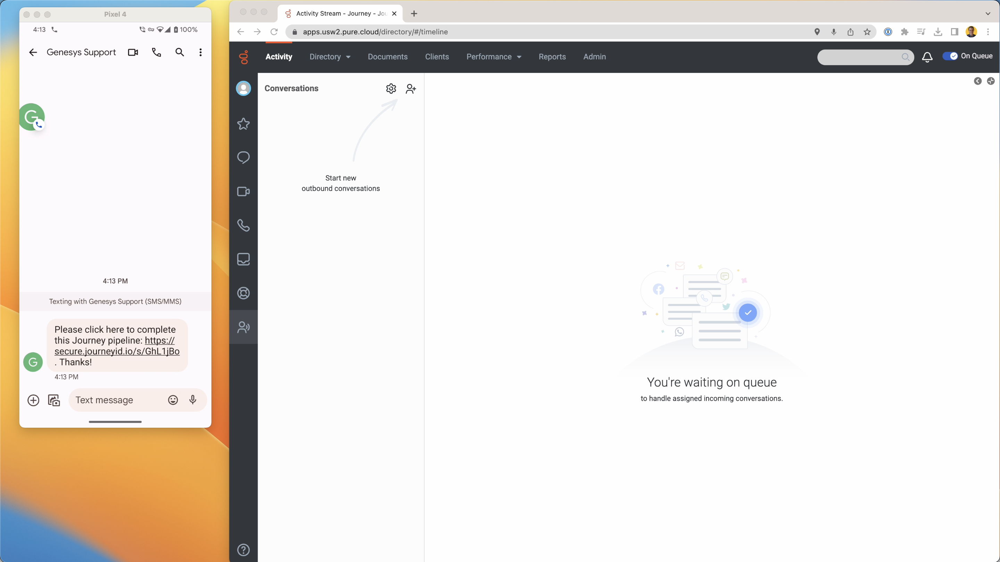

# Journey’s Genesys Premium Application

## Introduction

With the Journey Elevate app, you will be able to create and execute pipelines that bring the capabilities of Genesys Architect to new heights. The Genesys premium application streamlines that setup process. This guide will explain a typical use case, then direct a Genesys user through the entire setup process.

### Typical use case

Here is a typical use case.

1. A known user calls into a call center, powered by Genesys Architect. They want to speak to an agent.

2. We recognize the phone number, and see the user has registered with device-based biometric authentication (aka FIDO). Therefore, we can authenticate them digitally, quickly and easily, before an agent gets on the line.

3. Using a Journey pipeline, we send them an SMS with a link to complete authentication. 
