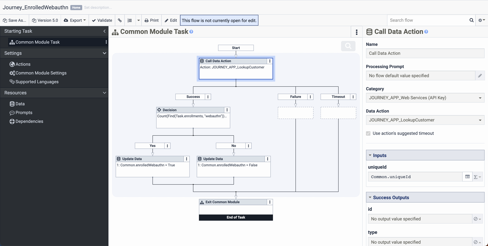
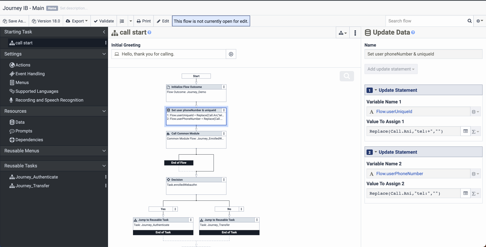
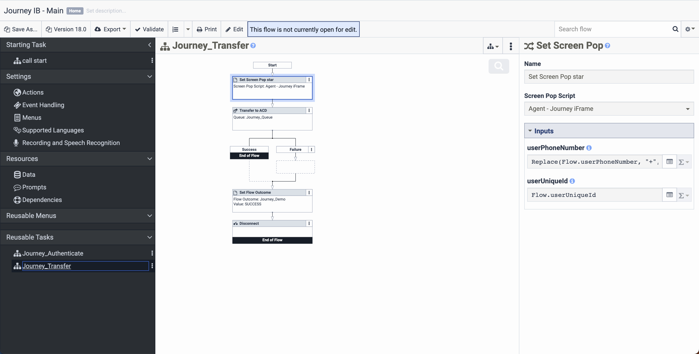
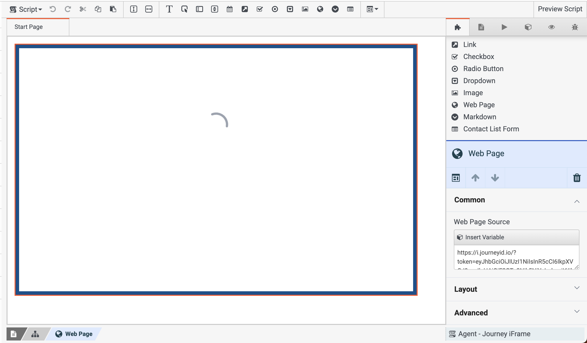

# Journey’s Genesys Premium Application

## Introduction

With the Journey Elevate app, you will be able to create and execute pipelines that bring the capabilities of Genesys Architect to new heights. The Genesys premium application streamlines that setup process. This guide will explain a typical use case, then direct a Genesys user through the entire setup process.

### Typical use case

Here is a typical use case.

1. A known user calls into a call center, powered by Genesys Architect. They want to speak to an agent.

2. We recognize the phone number, and see the user has registered with device-based biometric authentication (aka FIDO, aka webauthn). Therefore, we can authenticate them digitally, quickly and easily, before an agent gets on the line.

3. Using a Journey pipeline, we send them an SMS with a link to complete authentication. 

4. The link opens a web page where they can complete the pipeline (in this case, device-based biometric authentication) 

5. With authentication complete, we transfer them to an agent using the Genesys Pure Cloud software. An embedded iFrame tells the agent that the authentication pipeline has already been completed. 

6. During the call, the agent can easily dispatch additional pipelines right from the iFrame, for instance to collect payments or e-signatures. The pipelines are delivered in a digital side-channel, same as before, either via SMS or mobile app. The caller can see the agent’s info associated with the pipeline, and the agent can see the pipeline completion status. 

## Setup

Installing the Journey Premium Application embed the Journey admin app (https://app.journeyid.io/) as a native Genesys app, provision a related "role", and create a few "data actions" that streamline the use of typical Journey APIs.

This guide will walk you through installing the app, then configuring the building blocks that will let you build powerful, custom inbound and outbound call flows involving Journey.

### Installing the Premium Application

Find the Journey App in the Genesys Appfoundry marketplace.

Walk through the installation wizard.

### Configuring data actions

After the install wizard runs, it will recreate a few “data actions”, which streamline the use of typical Journey APIs. For this to work properly, you must still add an API key.

This is generated from the Journey admin page, under the settings tab.

To add the key to Genesys, click any of the data actions prefaced with “JOURNEY_APP”.

Then, click the “user defined” link to open a new tab containing the underlying web data service.

From here, navigate to the “Credentials” tab and you can hit the “change” button and update the key. Make sure the field name is apiKey.

### Creating the common module flows

The next level of building block that will enable powerful, custom inbound and outbound flows involving Journey is the "common module".

We would suggest building some common modules that relate to the data actions created automatically.

#### ExecutePipeline

Here is one for “ExecutePipeline”. It simply calls the `JOURNEY_APP_ExecutePipeline` data action, passing along requisite info, then evaluates the response. If the response contains an `executionId` then the operation was a success, otherwise a failure.

> You can import and customize from the provided YAML here: [./flows/common_modules/Journey_ExecutePipeline.yaml](./flows/common_modules/Journey_ExecutePipeline.yaml).

#### EnrolledWebauthn

Here is a similar common module flow that checks if the user who has called in enrolled with Journey in passwordless authentication, in this case FIDO/Webauthn.

We use the `JOURNEY_APP_LookupCustomer` data action, to call the Journey API and see if we can recognize this customer by their uniqueId, which is typically derived from their phone number. (Ie, if their phone number is +15555555555, then their uniqueId is 15555555555).

If the customer is recognized, the response from Journey will include a list of their "enrollments". We can use the Genesys expression builder to check that list of enrollments for the one we care about-- "webauthn". If found,this module will return `enrolledWebauthn: true`, otherwise `enrolledWebauthn: false`.

The expression looks like this: `Count(Find(Task.enrollments, "webauthn")) > 0`.

> You can import and customize from the provided YAML here: [./flows/common_modules/Journey_EnrolledWebauthn.yaml](./flows/common_modules/Journey_EnrolledWebauthn.yaml).

#### PollForCompletion

Finally, here is a more complex common flow relating to the `JOURNEY_APP_CheckForCompletion` data action.

Here we use the data action to check the Journey API to see if a given pipeline has been completed (ie, we submit the execution ID and see if the response contains the `completedAt` field). If so, return success, if not, return failure. The tricky part is that we loop 60 times before timing out, and we hijack the audio capability to provide a brief pause between loops.

> You can import and customize from the provided YAML here: [./flows/common_modules/Journey_PollCompletion.yaml](./flows/common_modules/Journey_PollCompletion.yaml).

### Creating the inbound flow

With all the building blocks in place, you can now create an inbound call flow. The following is a minimal example, which can be customized to your needs. A brief explanation is given, along with screenshots. Details can be found in the exported YAML.

In the "call start" section...

- The inbound call is received.
- Variables for `userUniqueId` and `userPhoneNumber` are set, which are based on the ANI, and make it easier to interact with the Journey APIs.
- The `Journey_EnrolledWebauthn` common module is called, to see if the user is enrolled in FIDO/Webauthn.
- If so, we will try to authenticate them using a "reusable task", ensuring the best possible service.
- If not, we will simply transfer them to an agent in an unauthenticated state.

In the "Journey_Authenticate" reusable task...

- We use the "Journey_ExecutePipeline" common module to send an SMS to the user, with a link to complete authentication.
- We use the "Journey_PollCompletion" common module to wait up to one minute for the user to complete authentication.
- If authentication is completed successfully before timeout, we play a success message before transferring to an agent. otherwise, we simply transfer to an agent in an unauthenticated state.

In the "Journey_Transfer" reusable task...

- Use the screen pop widget embed the Journey iFrame in the agent's Pure Cloud interface, using a Genesys script. (More details below.)

> You can import and customize from the provided YAML here: [./flows/Journey_IB_Demo.yaml](./flows/Journey_IB_Demo.yaml).

#### Script - Embedded iFrame

One part of this flow requires additional explanation.

To embed the Journey Agent iFrame into Genesys Pure Cloud interface, we use a screen pop widget in the previous step which is linked to a script.

That script must be configured in the Genesys admin panel. The settings can be found in "scripts" under "contact center".

The script should contain a single web page element, with the following URL:

`https://i.journeyid.io/?token=[[INSERT_TOKEN_HERE]]&session%5BexternalRef%5D={{Scripter.Interaction ID}}&user%5BuniqueId%5D={{userUniqueId}}&user%5BphoneNumber%5D={{userPhoneNumber}}`

The iFrame will be configured on the Journey side, in the admin app, under the iFrame tab. There is a submenu for "deployment instructions" wherein you can generate the necessary token.

> You can import an example [here](./flows/journey_iframe.script).
