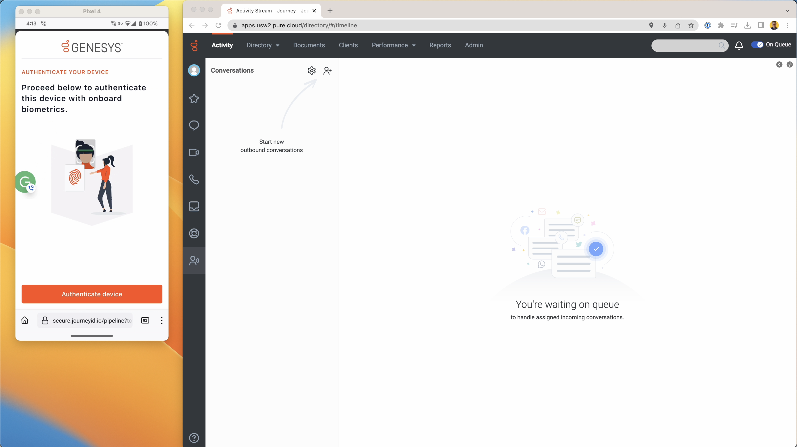
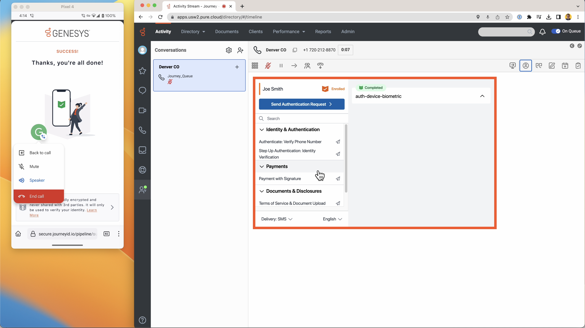
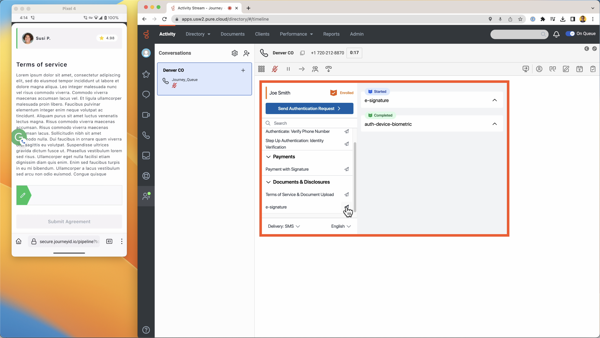
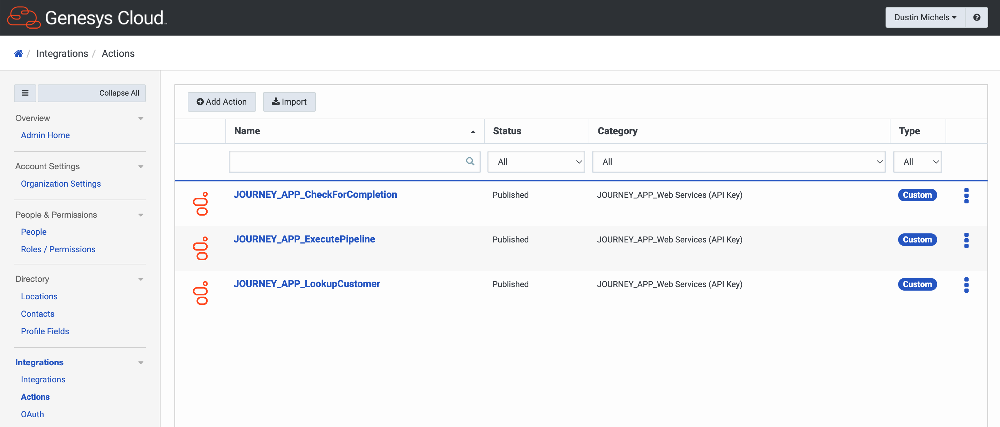
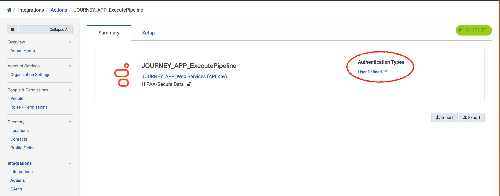
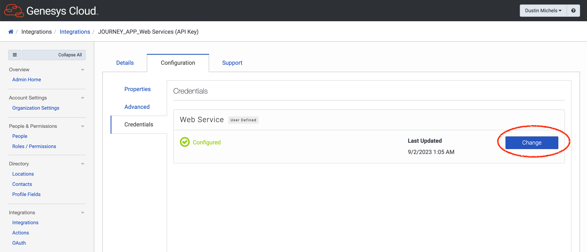
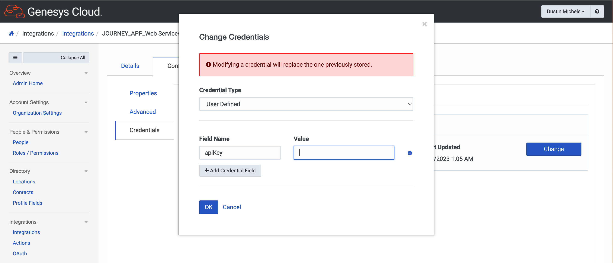
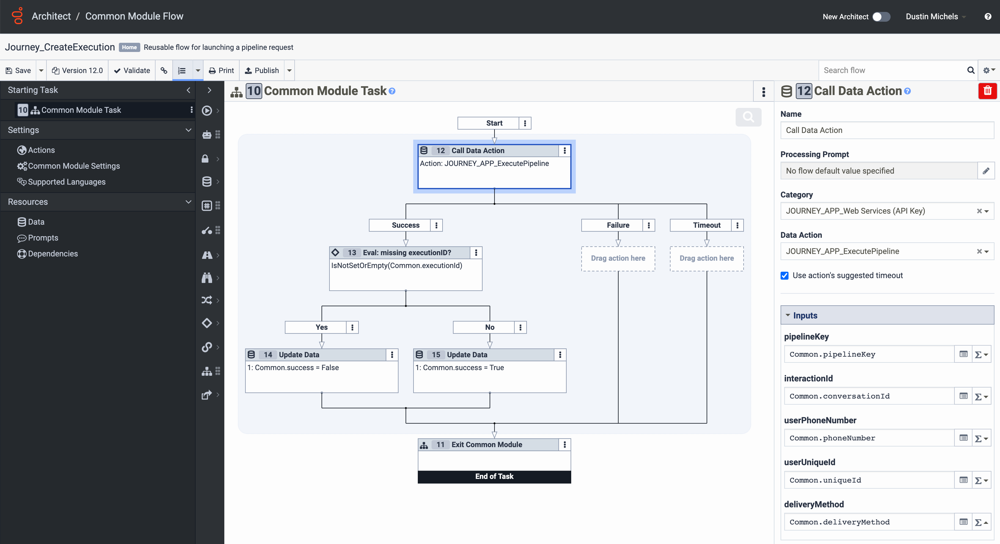
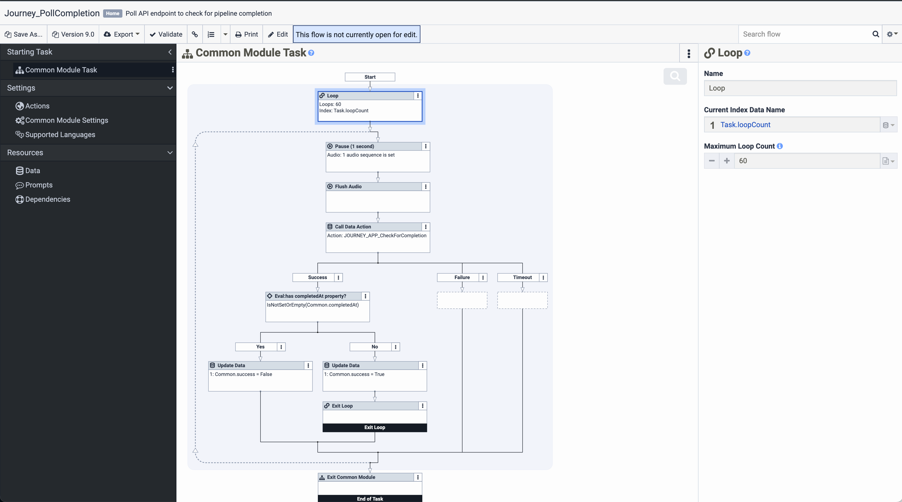

# Journey’s Genesys Premium Application

## Introduction

With the Journey Elevate app, you will be able to create and execute pipelines that bring the capabilities of Genesys Architect to new heights. The Genesys premium application streamlines that setup process. This guide will explain a typical use case, then direct a Genesys user through the entire setup process.

### Typical use case

Here is a typical use case.

1. A known user calls into a call center, powered by Genesys Architect. They want to speak to an agent.

2. We recognize the phone number, and see the user has registered with device-based biometric authentication (aka FIDO). Therefore, we can authenticate them digitally, quickly and easily, before an agent gets on the line.

3. Using a Journey pipeline, we send them an SMS with a link to complete authentication. 

4. The link opens a web page where they can complete the pipeline (in this case, device-based biometric authentication) 

5. With authentication complete, we transfer them to an agent using the Genesys Pure Cloud software. An embedded iFrame tells the agent that the authentication pipeline has already been completed. 

6. During the call, the agent can easily dispatch additional pipelines right from the iFrame, for instance to collect payments or e-signatures. The pipelines are delivered in a digital side-channel, same as before, either via SMS or mobile app. The caller can see the agent’s info associated with the pipeline, and the agent can see the pipeline completion status. 

## Setup

Installing the Journey Premium Application embed the Journey admin app (https://app.journeyid.io/) as a native Genesys app, provision a related "role" and "group", and create a few "data actions" that streamline the use of typical Journey APIs.

This guide will walk you through installing the app, then configuring the building blocks that will let you build powerful, custom inbound and outbound call flows involving Journey.

### Installing the Premium Application

### Configuring data actions

After the install wizard runs, it will recreate a few “data actions”, which streamline the use of typical Journey APIs. For this to work properly, you must still add an API key.

This is generated from the Journey admin page, under the settings tab.

To add the key to Genesys, click any of the data actions prefaced with “JOURNEY_APP”.

Then, click the “user defined” link to open a new tab containing the underlying web data service.

From here, navigate to the “Credentials” tab and you can hit the “change” button and update the key. Make sure the field name is apiKey.

### Creating the common module flows

The next level of building block that will enable powerful, custom inbound and outbound flows involving Journey is the "common module".

We would suggest building some common modules that relate to the data actions created automatically.

For example, here is one for “ExecutePipeline”. It simply calls the `JOURNEY_APP_ExecutePipeline` data action, passing along requisite info, then evaluates the response. If the response contains an “executionId” then the task was a success, otherwise a failure.

Next, here is a more complex common flow relating to the `JOURNEY_APP_CheckForCompletion` data action. Here we use the data action to check the Journey API to see if a given pipeline has been completed (ie, if the response contains the `completedAt` field). If so, return success, if not, return failure. The tricky part is that we loop 60 times before timing out, and we hijack the audio capability to provide a brief pause between loops.

